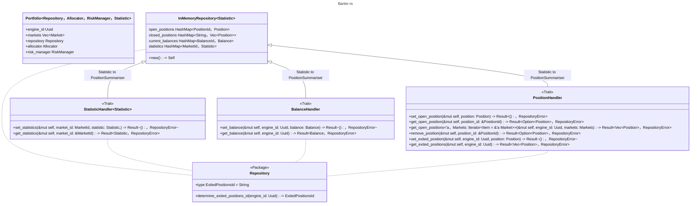

```mermaid
---
title: Barter-rs
---
classDiagram
    class Portfolio~Repository，Allocator，RiskManager，Statistic~ {
        +engine_id Uuid
        +markets Vec~Market~   
        +repository Repository 
        +allocator Allocator 
        +risk_manager RiskManager
    }

    class InMemoryRepository~Statistic~ {
        open_positions HashMap~PositionId，Position~
        closed_positions HashMap~String，Vec~Position~~
        current_balances HashMap~BalanceId，Balance~
        statistics HashMap~MarketId，Statistic~

        +new() -> Self
    }
    class PositionHandler {
        <<Trait>>
        +set_open_position(&mut self, position: Position) -> Result<()，RepositoryError>
        +get_open_position(&mut self, position_id: &PositionId) -> Result~Option~Position~，RepositoryError~
        +get_open_positions~'a，Markets: Iterator~Item = &'a Market~~(&mut self, engine_id: Uuid, markets: Markets) -> Result~Vec~Position~，RepositoryError~
        +remove_position(&mut self, position_id: &PositionId) -> Result~Option~Position~，RepositoryError~
        +set_exited_position(&mut self, engine_id: Uuid, position: Position) -> Result~()，RepositoryError~
        +get_exited_positions(&mut self, engine_id: Uuid) -> Result~Vec~Position~，RepositoryError~
    }
    InMemoryRepository <|-- PositionHandler : Statistic to PositionSummariser

    class BalanceHandler {
        <<Trait>>
        +set_balance(&mut self, engine_id: Uuid, balance: Balance) -> Result~()，RepositoryError~
        +get_balance(&mut self, engine_id: Uuid) -> Result~Balance，RepositoryError~
    }

    InMemoryRepository <|-- BalanceHandler : Statistic to PositionSummariser

    class StatisticHandler~Statistic~ {
        <<Trait>>
        +set_statistics(&mut self, market_id: MarketId, statistic: Statistic,) -> Result~()，RepositoryError~
        +get_statistics(&mut self, market_id: &MarketId) -> Result~Statistic，RepositoryError~
    }

    InMemoryRepository <|-- StatisticHandler : Statistic to PositionSummariser

    class Repository {
        <<Package>>
        +type ExitedPositionsId = String
        +determine_exited_positions_id(engine_id: Uuid) -> ExitedPositionsId
    }
    InMemoryRepository..Repository
    StatisticHandler..Repository
    BalanceHandler..Repository
    PositionHandler..Repository

```